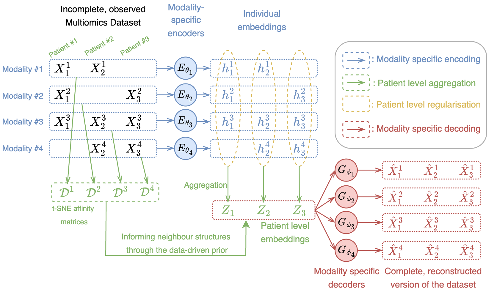

# MIND: Multimodal Integration with Neighbourhood-aware Distributions

[](https://github.com/hwxing3259/MIND-revised/actions/workflows/ci.yml)
[](LICENSE)
[](https://www.python.org)

**MIND** learns a single per-patient embedding from several omics modalities
(e.g. RNA-seq, DNA-methylation, copy-number, miRNA) even when most patients
appear in only some of them. It is a VAE in which each modality has its own
encoder/decoder pair and the shared latent space is regularised to preserve
each modality's neighbourhood structure.

The package is associated with the bioRxiv preprint
[*Multimodal Integration with Neighbourhood-aware Distributions*](https://www.biorxiv.org/content/10.1101/2025.09.15.676314v1.full.pdf)
(Xing & Yau, 2025).

<p align="center"></p>

---

## What it does (in one paragraph)

You hand MIND a dictionary `{modality_name: pandas.DataFrame}` where every
DataFrame has the same number of rows (one per patient) and rows for missing
patients are all-NaN. MIND returns (1) a low-dimensional patient embedding
that you can feed into any downstream classifier or survival model, and
(2) per-modality reconstructions that fill in the missing rows.

---

## Installation

### From source

```bash
git clone https://github.com/hwxing3259/MIND-revised.git
cd MIND-revosed
pip install -e .
```

### From GitHub directly

```bash
pip install git+https://github.com/hwxing3259/MIND-revised.git
```

The package targets Python 3.10–3.12 and is tested on macOS and Ubuntu.
See `pyproject.toml` for the dependency ranges.

---

## Quickstart (no download required)

The fastest way to verify your installation is to train MIND on a built-in
synthetic dataset:

```python
from MIND import MIND
from MIND.data import make_toy_dataset

data = make_toy_dataset(n=200, n_modalities=3, n_features=50, seed=0)
modalities = {k: v for k, v in data.items() if k != "cls"}

model = MIND(modalities, emb_dim=16, device="cpu")
model.my_train(n_epoch=200, lr=1e-3)

z_mean, _ = model.get_embedding()        # (200, 16) shared embeddings
recons    = model.predict()              # one tensor per modality
```

This runs in well under a minute on a laptop and exercises the full
training/inference path without touching the network. See
[`examples/quickstart_toy.ipynb`](examples/quickstart_toy.ipynb) for a
narrated walkthrough including a 2-D embedding plot and how to swap in your
own data.

---

## Reproducing the paper's numerical examples

Each dataset has a `get_*` (download) and `load_*` (read into DataFrames)
helper. The `load_*` helpers will trigger a download automatically if the
local files are missing, so a one-liner suffices:

```python
from MIND import MIND
from MIND.data import load_TCGA

data = load_TCGA(cancer_type="BRCA", task="all")
clinic = data.pop("clinical")
model = MIND(data, emb_dim=64, device="cpu")
model.my_train(n_epoch=5000, lr=1e-4)
```

Or, for a single-command reproduction script:

```bash
python examples/reproduce_results.py --dataset TCGA --cancer BRCA
python examples/reproduce_results.py --dataset CCMA
python examples/reproduce_results.py --dataset CCLE
python examples/reproduce_results.py --dataset synthetic
```

The reproduction script downloads the data on first run, trains MIND with
the paper's hyperparameters, and writes the resulting embeddings + clinical
metadata to `./MIND_outputs/`.

The accompanying notebooks live under `examples/` and `examples/README.md`
indexes them by difficulty.

---

## Applying MIND to your own data

See [`docs/user_guide.md`](docs/user_guide.md) for the full guide. In short:

1. Build a dictionary `{modality_name: pandas.DataFrame}` where every
   DataFrame has the **same row index** (one row per patient). Rows for
   patients missing from a modality must be **all NaN**.
2. Standardise / z-score each modality's features beforehand — MIND assumes
   roughly unit-scale Gaussian features.
3. Choose `emb_dim` between 32 and 128 (default 128). Smaller for
   visualisation, larger for downstream prediction.
4. Train for several thousand epochs (default `n_epoch=2000`, `lr=1e-3`).
   On modest datasets the loss plateaus well before this.

---

## Comparison to similar tools

| Tool | Architecture | Handles barcode missingness | Output |
|---|---|---|---|
| **MIND** | VAE w/ neighbourhood-preserving prior | Native (NaN rows) | Shared embedding + per-modality reconstruction |
| [MOFA+](https://biofam.github.io/MOFA2/) | Linear factor model (Bayesian) | Yes (factor-level) | Latent factors |
| [scVI / totalVI](https://scvi-tools.org/) | VAE | Yes (single-cell focus) | Per-cell embedding |
| [scIB / Scanorama](https://scanpy.readthedocs.io/) | Linear / NN integration | Partial | Aligned data matrix |

MIND is closest to MOFA+ in scope (bulk multi-omics) but uses a deep VAE
backbone and a t-SNE-style neighbourhood term that explicitly preserves the
geometry of each modality.

---

## Documentation

The Sphinx documentation is built from `docs/`. To build it locally:

```bash
pip install -e .[docs]
cd docs && make html
open _build/html/index.html
```

A `.readthedocs.yaml` is included so the package can be pointed at
[Read the Docs](https://readthedocs.org/) by toggling the project on.

---

## Tests

```bash
pip install -e .[dev]
pytest -q
```

The test suite is network-free, runs in well under a minute on CPU, and
covers the data loaders (with `requests` mocked), the model forward/backward
passes, and the input-validation helpers.

---

## Citing

If you use MIND in academic work, please cite both the software and the
paper:

```bibtex
@article{xing2025mind,
  author  = {Xing, Hanwen and Yau, Christopher},
  title   = {Multimodal Integration with Neighbourhood-aware Distributions},
  journal = {bioRxiv},
  year    = {2025},
  doi     = {10.1101/2025.09.15.676314},
  url     = {https://www.biorxiv.org/content/10.1101/2025.09.15.676314v1.full.pdf}
}

@software{mind_software,
  author  = {Xing, Hanwen},
  title   = {MIND: Multimodal Integration with Neighbourhood-aware Distributions},
  version = {0.1.0},
  year    = {2026},
  url     = {https://github.com/hwxing3259/MIND-revised}
}
```

A machine-readable `CITATION.cff` is also included.

---

## Contributing & bug reports

Please open issues and pull requests at
<https://github.com/hwxing3259/MIND-revised/issues>.

See [`AUTHORS.md`](AUTHORS.md) for the maintainer list and
[`CHANGELOG.md`](CHANGELOG.md) for release notes.
